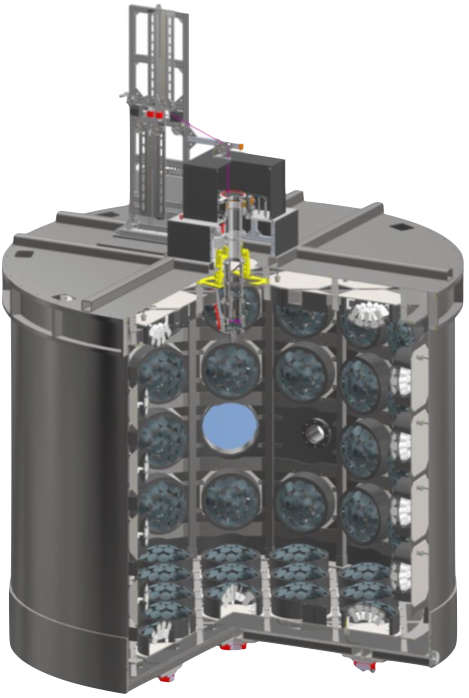
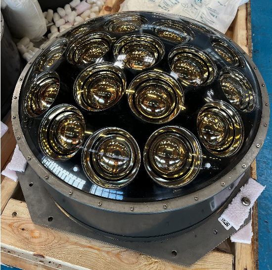
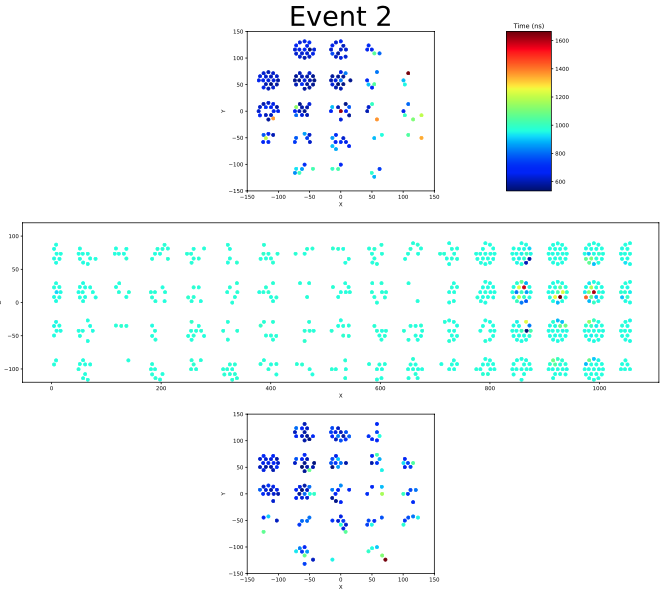
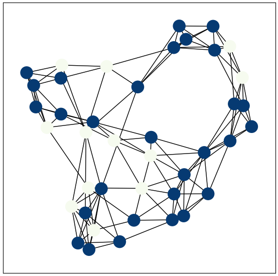

# WCTE Analysis Using Neural Networks

This is a first attempt of coding, training and making predictions with a Graph Neural Network for separating Dark Noise (background) hits from Signal hits in WCTE. 

# WCTE
The Water Cherenkov Test Experiment consists in a cylindrical volume filled with water in which particles produce Cherenkov light, which is detected by the detectors in the walls the mPMTs, see [Figure 1](#fig1) and [Figure 2](#fig2).
Every mPMT has 19 regular PMTs inside, and Cherenkov photons can hit one of those 19 PMTs and produce a signal (that we call hit) with a characteristic time, charge and position signature.

<table style="width: 100%; text-align: center;">
  <tr>
    <td style="width: 50%; padding: 10px;">
      <a id="fig1"></a>
      <br>
      <p>Figure 1: The Water Cherenkov Test Experiment.</p>
    </td>
    <td style="width: 50%; padding: 10px;">
      <a id="fig2"></a>
      <br>
      <p>Figure 2: Close up of a mPMT.</p>
    </td>
  </tr>
</table>

When analyzing it, the data is split in what we call events, a selected time window in which what we want to study occurs, normally, a initial particle enters the detector volume and produces the light that produces the hits we see in the detectors, giving something like [Figure 3](#fig3). 

However, not every hit that we record in each event is real signal, what we want to study, but spurious hits called background we want to get rid of. For this, we're trying to code a Graph Neural Network for segmentation, where every "pixel" is a "hit", and every "image" is an "event". For this, we're transforming every event into a graph, were every node is a hit and has two features (charge and time), and the edges feature is the physical distance between hits in the tank, see [Figure 4](#fig4).

<table style="width: 100%; text-align: center;">
  <tr>
    <td style="width: 50%; padding: 10px;">
      <a id="fig3"></a>
      <br>
      <p>Figure 3: Signal of one event, every dot represent a hit in a PMT.</p>
    </td>
    <td style="width: 50%; padding: 10px;">
      <a id="fig4"></a>
      <br>
      <p>Figure 4: Graph created from hits information (NOTE that this graph does NOT come from the plot in the left).</p>
    </td>
  </tr>
</table>

# Current Status
We now can train the net using the `main.py` script and the training info and metrics are written to the Tensorboard logger. You need to change the parameters in the config file dedicated to the model you are using.

# How to
1. At the moment, first you need to create a dataset for your data. You can do that running
   ```
   python3 scripts/create_dataset.py -conf scripts/config_files/dataset_creation.conf
   ``` 
3. Then you need to check `scripts/config_files/GAT.conf` and tune the parameters you want to use.
4. Then run `main.py` doing
   ```
   python3 main.py -conf scripts/config_files/GAT.conf -a train
   ```
6. Once the training is completed and tensorboard file created, you can open the web application doing:
   ```
   tensorboard --logdir=.
   ```
   from the directory where the tensorboard file is located.

# To-Do
- Add prediction to the `main.py` function.
- ~Add a dedicated script that creates the graph dataset and stores it somewhere the net can read it from.~
- In general, improve performance of the net.
